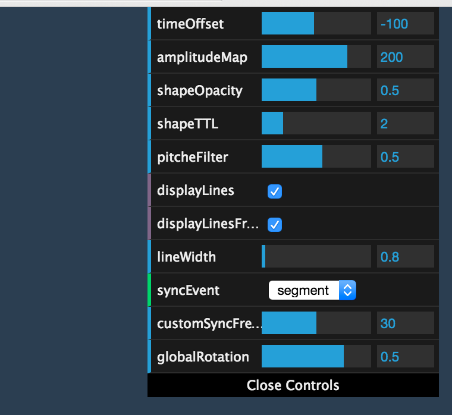

# Etienne DLDC | Gobelins's creative workshop

## Note d'intention

Ayant déjà utilisé l'API audio pour visualiser les différentes bandes de fréquence et l'amplitude j'ai décider, pour ce Workshop, d'allez plus loin dans l'analyse du son.  
En effet les bandes de fréquences ne permettent pas de distingué les différents son / les différentes notes clairement et il est difficile d'aller au delà d'une analyse (aigues / mediums / graves).  
Mon objectif était donc d'obtenir une visualisation où le spectateur peut clairement identifier un éléments graphique comme étant lié à un son.

## Story Board

### Premiere version

### Version finale

### Diférences entre les deux versions

Mon story board finale n'est pas trop éloigné de ce que j'avais imaginé au début, cependant quelques différences subsistes :
- Les élément apparaisse par rapport au centre plutot que de maniere aléatoire sur l'écran.
- Les éléments sont moins variés que dans la version originale.

## Getting Started

Pour lancer le projet, il suffit de se rendre dans le dossier `static` et d'ouvrir le fichier `index.html` dans un navigateur.  
Le projet à été dévellopé avec la version 46 de Google Chrome. Il a également été tester sous Firefox 42.

### Utilisation de DAT-GUI

Le projet utilise la librairie DAT-GUI afin de controller certain parametres du codes.

Les différents parametres sont :

| Parametre | Fonctionnalité     |
| :------------- | :------------- |
| `timeOffset`   | Permet de décaler l'analyse des données et le son. |
| `amplitudeMap` | Permet de regle la distance maximum des éléments par rapport au centre. |
| `shapeOpacity` | Opacité des forme lorsqu'elles sont crées. |
| `shapeTTL` | Durée de vie des formes (en secondes). |
| `pitcherFilter` | Permet de modifier le nombre de formes différentes. Plus la valeur est élévée moins il y a de formes. |
| `displayLines` | Afficher / Cacher les lignes entre les formes. |
| `displayLinesFromCenter` | Afficher / Cacher les lignes entre les formes et le centre |
| `lineWidth` | Largeur des lignes |
| `syncEvent` | Evenement avec lequel sont synchronisés les formes |
| `customSyncFrequency` | Uniquement si `syncEvent` vaut "custom". Permet de choisir la frequence d'apparition des formes. |
| `globalRotation` | Vitesse de rotation de l'ensemble des éléments |
